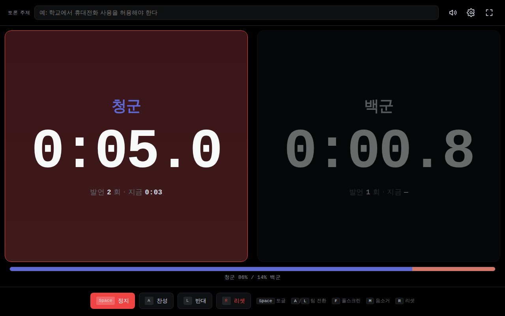
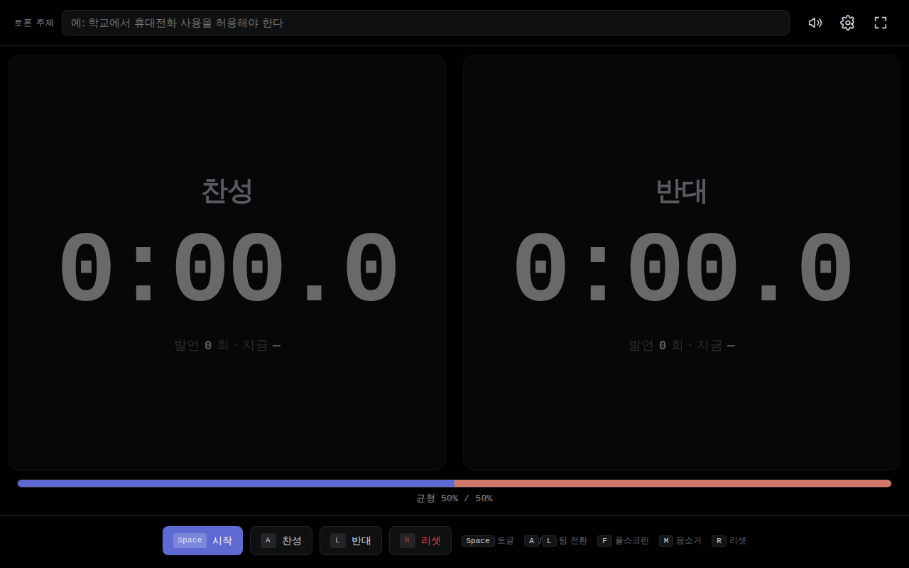
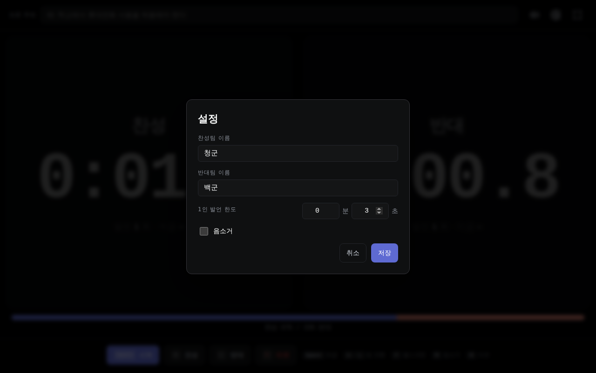

# Day 03 · 토론 발언 타이머 — 찬·반 누적시계

> 100일 1바이브코딩 챌린지 **#003** · 초등 4~6학년 교실용. 토론 수업의 찬·반팀 누적 발언 시간을 무대형 풀스크린에 표시해, 발언 시간 격차를 학생들이 한눈에 확인하고 균형 잡힌 토론을 진행할 수 있게 한다.



## 핵심 기능

- **좌(찬성) · 우(반대) 누적 시간 풀스크린 표시** — 모노스페이스 거대 숫자로 TV 8m 거리에서도 또렷.
- **스페이스 키 한 손 토글** — 토론 진행 중 양손 자유롭지 않은 교사 상황에 맞춰 단축키 기반 컨트롤.
- **1인 발언 한도 + 시각·청각 경고** — 80% 도달 약경고 색 + 짧은 비프, 100% 초과 시 critical red flash + 더블 비프.
- **발언 횟수 카운트** — 양 팀별 누적 발언 횟수 자동 집계.
- **균형 바** — 화면 하단에 양 팀 누적 시간 비율 가로 막대로 즉각 시각화 (`찬성 86% / 14% 반대`).
- **풀스크린 모드** — `F` 키 또는 버튼.
- **음소거 토글** — `M` 키. 비프음 즉시 차단.
- **휘발성 + 설정 영속화** — 누적 시간은 세션 종료시 사라짐. 팀 이름·1인 한도·음소거 상태·토론 주제만 `localStorage`에 저장되어 다음 수업 재사용 가능.

## 키보드 단축키

| 키 | 동작 |
|---|---|
| `Space` | 활성 팀 발언 시작·정지 토글 |
| `A` | 찬성팀(왼쪽) 활성·즉시 시작 |
| `L` | 반대팀(오른쪽) 활성·즉시 시작 |
| `F` | 풀스크린 토글 |
| `M` | 음소거 토글 |
| `R` | 리셋 (확인 모달) |
| `Esc` | 모달 닫기 |

한국어 IME 상태(`ㅁ`/`ㅣ`/`ㄹ`/`ㅡ`/`ㄱ`)에서도 동일하게 동작한다.

## 실행 방법

### 1) GitHub Pages (브라우저에서 바로)
→ https://989-alt.github.io/project-03-toron-bareon-taimeo/

### 2) 로컬
```bash
git clone https://github.com/989-alt/project-03-toron-bareon-taimeo.git
cd project-03-toron-bareon-taimeo
python3 -m http.server 5180
# 브라우저에서 http://127.0.0.1:5180/ 열기
```

### 3) 테스트
```bash
pip install playwright
python3 -m playwright install chromium
python3 -m http.server 5180 --directory . &
APP_URL=http://127.0.0.1:5180/ python3 tests/e2e.py
```

## 스크린샷

| 초기 화면 | 한도 초과 (critical) | 설정 |
|---|---|---|
|  |  |  |

## 적용한 디자인

- **메인 브랜드**: **Linear** (`awesome-design-md/design-md/linear.app/DESIGN.md`)
  - 깊은 검정 canvas (`#010102`) + 모노 등폭 숫자 + 시그니처 라벤더 (`#5e6ad2`)
  - 토픽 명세 ("Linear 키보드·정밀 / 보조: Vercel 흑백 정밀") 그대로 채택
- 두 팀 구분을 위해 라벤더의 보색 코랄(`#d2786a`)을 반대팀에 페어로 확장 — 좌/우 색 차이를 주되 녹·적 사용을 피해 우열 판단 인상을 회피.
- 모든 폰트는 시스템 폰트 + JetBrains Mono(로컬 폴백) — **CDN 의존 0**.

## 토픽 명세 준수

100-vibecoding-topics.md #003 발췌:
- ✅ 좌/우 분할 누적 타이머
- ✅ 발언 횟수 카운트
- ✅ 1인 발언 한도 알림
- ✅ 시작/종료 비프음 (Web Audio API)
- ✅ 풀스크린 모드
- ❌ 발언 내용 녹음·저장 — 의도적 미구현 (명세 배제 항목)
- ❌ 음성 인식·발언자 식별 — 미구현
- ❌ 서버 동기화·외부 공유 — 미구현 (휘발성 도구)

## 기술 스택

- 단일 `index.html` + `styles.css` + `app.js` (vanilla)
- Web Audio API (비프음)
- Fullscreen API
- localStorage (설정만)
- 빌드 도구·서버·DB 없음

## 사용 skill (1일 1바이브코딩 챌린지 구조)

| 단계 | skill | 산출물 |
|---|---|---|
| Brainstorm | `brainstorming/SKILL.md` | `docs/plans/01-brainstorm.md` (MUST/SHOULD/MUST NOT) |
| UI/UX | `ui-ux-pro-max/SKILL.md` + `awesome-design-md` Linear | `docs/plans/02-ui-ux.md` |
| Full Stack Dev | `senior-devops/SKILL.md` (코드 품질 원칙만) | `index.html` + `styles.css` + `app.js` |
| Tester | `webapp-testing/SKILL.md` + `scripts/with_server.py` | `tests/e2e.py`, 12-step screenshots |

ralph loop 3사이클 (BUG-1 idle 복귀 + BUG-2 폰트 오버플로 해결).

## 데이터 보호

- 학생 사진·이름·번호 입력 UI **없음**.
- 발언 내용·식별 정보 **없음**.
- 누적 시간은 세션 종료시 자동 소멸 (휘발성).
- 외부 서버 전송 **없음**, Gemini 등 AI API **미사용**.
- localStorage에는 팀 이름(예: "찬성"/"반대" 또는 "청군"/"백군"), 한도, 음소거 상태, 토론 주제 텍스트만.

## 라이선스

MIT.
